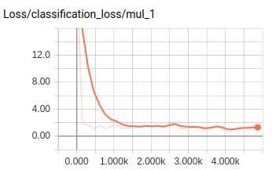
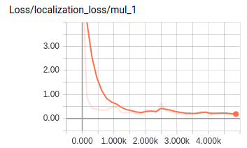
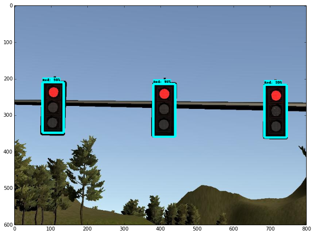

### Traffic Light Detector

The tl_detector node consists of two part: tl_detector.py and tl_classifier.py.  

#### tl_detector.py

This node subscribes to the following topic:

* /base_waypoints: complete waypoint list of the track

* /current_pose: vehicle position at map coordinate.

* /image_color: images from the front facing camera on the car.

For testing, we also subscribes to:

* /vehicle/traffic_lights: provides traffic light position and state.

This node will publish the upcoming stop point if there is a red light ahead to:

* /traffic_waypoint

This node is finised with following step:

1. Get all the traffic light positions.

2. Get the closest waypoint to the car position from current pose.

3. Find the nearest traffic light

4. Check the state from /vehicle/traffic_lights topic.

5. Return the position waypoint if it is red or return -1 if it is at other state.

At this point, the /traffic_waypoint topic starts to publish meaningful values. The others can move on to finalize the waypoint_updater node. The traning image can also be obtained by checking the distance between car and traffic light. We saved the images when traffic light is less then 100m ahead the car.

#### tl_classifier.py

The classifier was built with [tensorflow object detection api](https://github.com/tensorflow/models/tree/master/research/object_detection). We choose ssd_inception as our model because it not only performs good but is also small enough that we can put it in the github repo. 

To train the model, we took 200 images from the simulator and split into train and test dataset with the ratio 8:2. The train dataset is manually labeled with [Sloth](https://cvhci.anthropomatik.kit.edu/~baeuml/projects/a-universal-labeling-tool-for-computer-vision-sloth/) with 4 different classes(Green, Yellow, Red and UNKNOW) as a yaml file. For ssd_inception model, the weight pre-trained with COCO dataset is available. We did transfer learning with the last layer for 5000 step. The training curve and an example of prediction on the test dataset show in the following figures.

After the model is ready, we just do step 4. in tl_detector.py with the model prediction instead of getting it from the /vehicle/traffic_light topic. The model was trained with rgb8, so we also have to modify the color channel from bgr8 to rgb8 with openCV.

In conclusion, the ssd_inception model works pretty good on traffic light classification and is able to publish reasonable value to the /traffic_waypoint topic.

